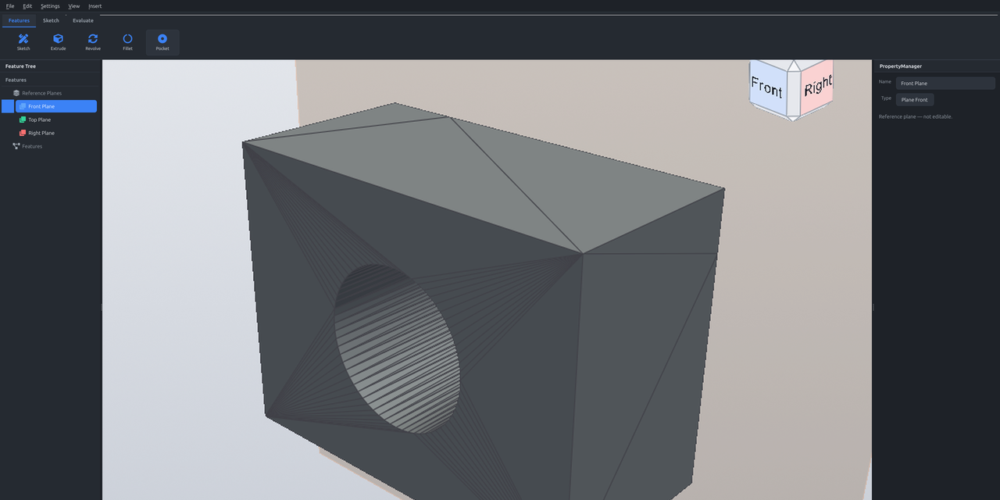
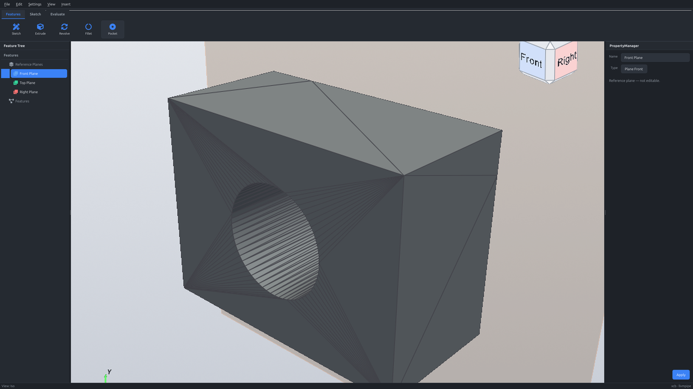
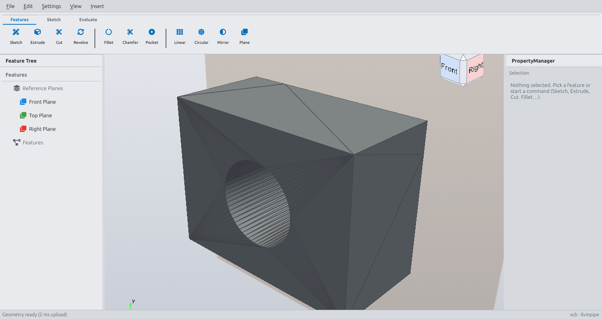
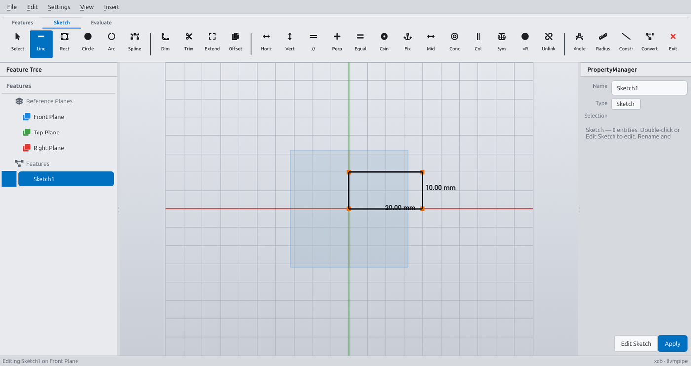
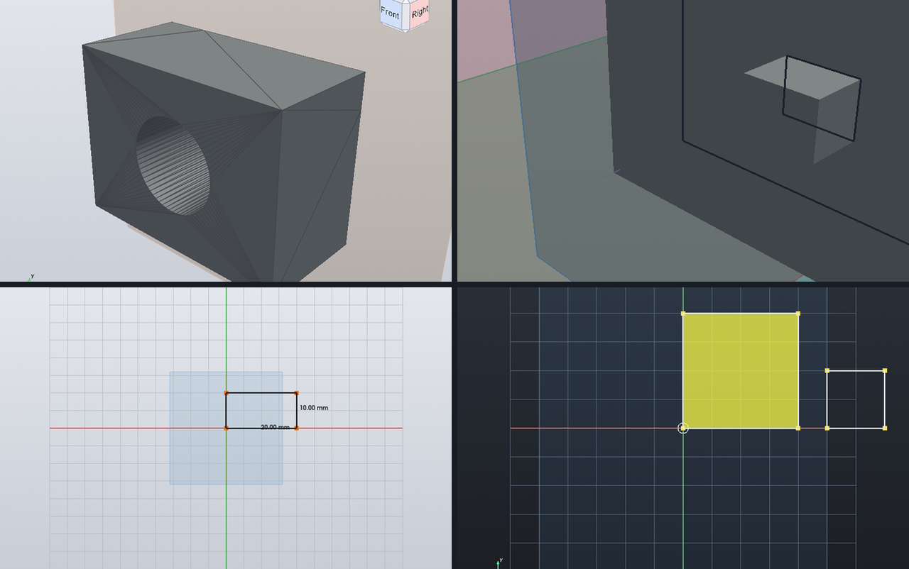
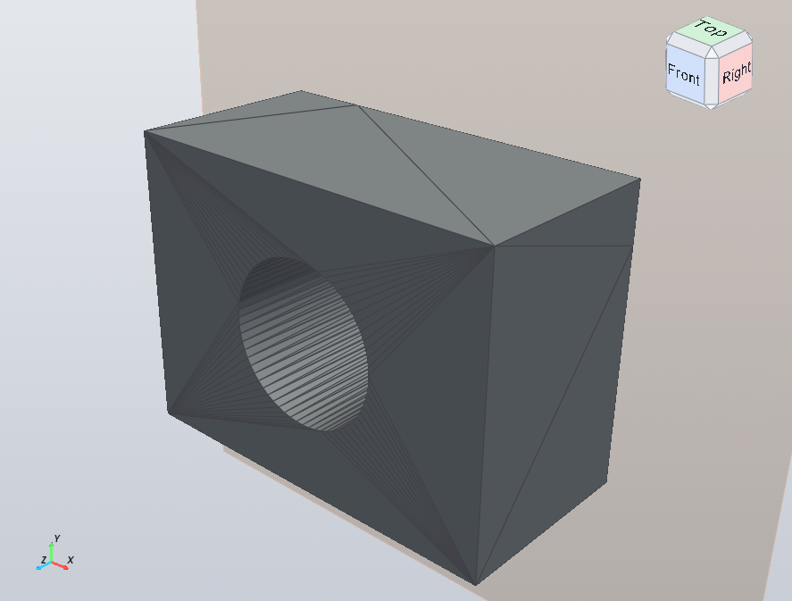
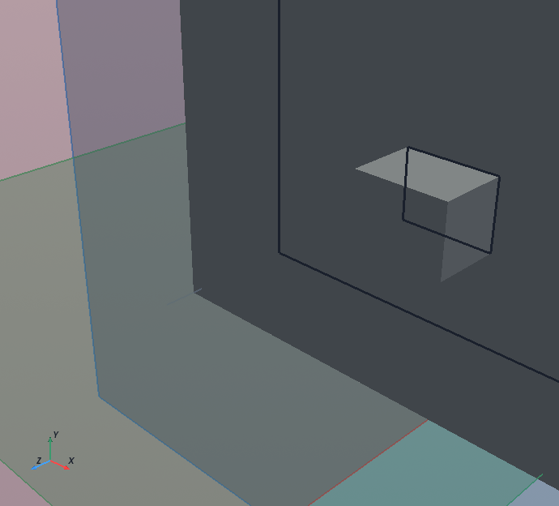
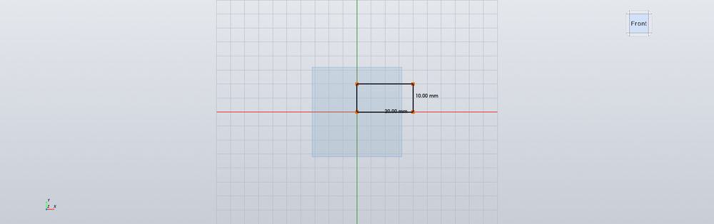
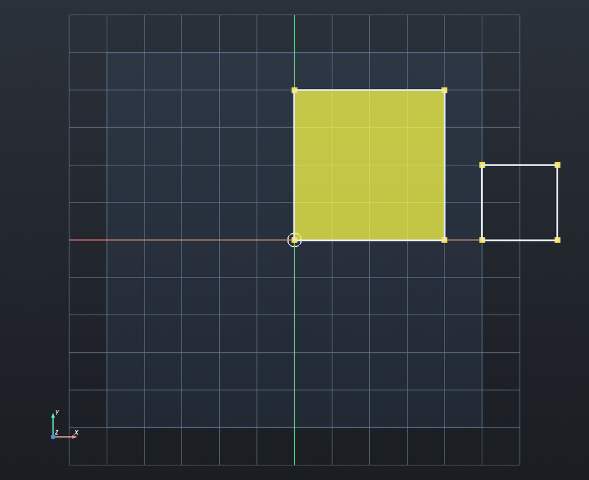
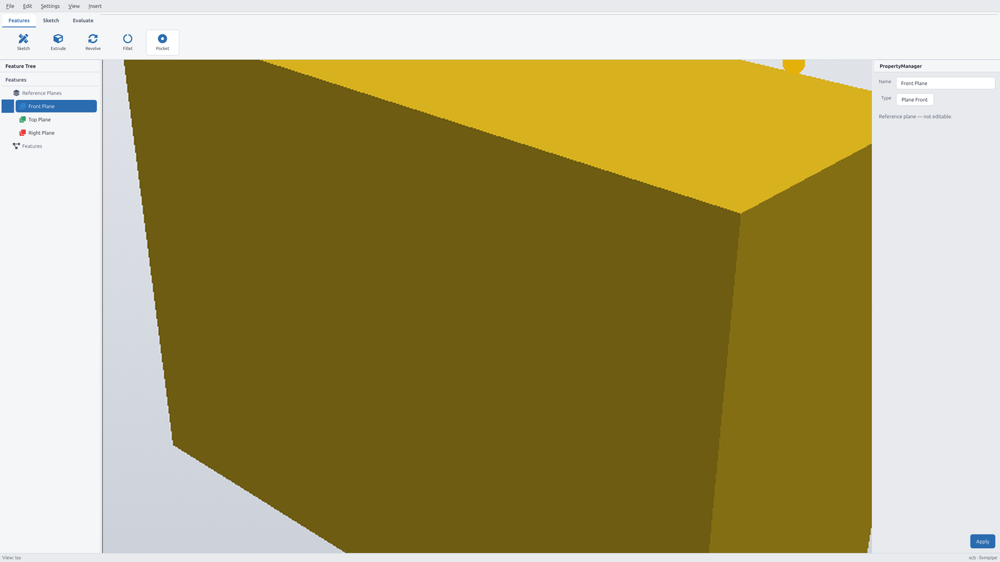

<p align="center">
  
</p>

<h1 align="center">Grok CAD</h1>

<p align="center">
  <strong>Open-source, SolidWorks-style parametric CAD — built in Python.</strong><br/>
  Sketch · constrain · extrude · cut · fillet · save. Real solids. Real workflow.
</p>

<p align="center">
  <a href="#features">Features</a> ·
  <a href="#screenshots">Screenshots</a> ·
  <a href="#quick-start">Quick start</a> ·
  <a href="docs/getting-started.md">Getting started</a> ·
  <a href="#architecture">Architecture</a> ·
  <a href="#roadmap">Roadmap</a> ·
  <a href="#contributing">Contributing</a>
</p>

<p align="center">
  
  
  
  
  
  
  
</p>

---

## Why Grok CAD?

Most open CAD stacks are either **heavy C++ monoliths** or **script-only geometry toys**.  
Grok CAD is something rarer: a **desktop product workflow** — feature tree, Command Manager, PropertyManager, undo, `.gcad` save/reopen — with a clean Python core you can actually read and extend.

| You get | How it works |
|--------|----------------|
| **SolidWorks-like UX** | Select → set params → OK / Cancel. Feature tree. Compact PM (~240px). |
| **Real solids** | Watertight CSG via **manifold3d** — booleans, not sketch-only hacks. |
| **Persistent sketching** | Constraints + driving dimensions that survive drag, save, and reopen. |
| **Hackable stack** | `cadcore/` is pure geometry (no GUI). `app/` is PySide6 + PyVista. |

> **Status:** actively developed foundation — not a FreeCAD clone, not a demo. Aimed at becoming a serious open-source parametric CAD product.

---

## Screenshots

### Dark workspace

<p align="center">
  
</p>

### Command Manager · Features & Sketch

<p align="center">
  
  &nbsp;
  
</p>

### Solids, sketches, profiles

<p align="center">
  
</p>

| Solid section + View Cube | Boss from face | Fully defined sketch | Closed profile fill |
|:---:|:---:|:---:|:---:|
|  |  |  |  |

<p align="center">
  
  <br/>
  <sub>Light theme available alongside dark.</sub>
</p>

---

## Features

### Modeling
- **Sketch** on reference planes or solid faces (lines, rectangles, circles, arcs)
- **Extrude** (boss) and **Cut-Extrude** with merge into the parent solid
- **Revolve**, **Pocket**, edge **Fillet** & **Chamfer**
- **Linear / Circular pattern**, **Mirror**, offset **planes**
- Face boss extrudes **boolean-union** into one continuous body (no double-counted volume)

### Sketch intelligence
- **Constraints:** coincident, horizontal, vertical, parallel, perpendicular, equal, fix, tangent, midpoint, concentric, collinear, symmetric, equal radius  
- **Driving dimensions:** length, diameter, radius, angle — hold through drag and save  
- **DOF coloring:** under-defined / fully defined / over-defined (SolidWorks-style)  
- **Trim / Extend** at intersections; profile fill for closed loops  
- Conflicts **refuse** and leave the sketch unchanged

### Product shell
- Feature tree + PropertyManager + Command Manager tabs  
- Undo / redo, edit-sketch rollback  
- Save / open **`.gcad`** projects; **STL** export  
- Section view (display clip), View Cube, dark & light themes  
- Unattended / headless mode for CI and benches (`GROK_CAD_UNATTENDED=1`)

### Stack
| Layer | Tech |
|-------|------|
| UI | **PySide6**, qtawesome |
| Viewport | **PyVista** + **pyvistaqt** (VTK) |
| Kernel | **manifold3d** watertight CSG |
| Math | **numpy**, **trimesh** |

---

## Quick start

> **First time?** Follow the full walkthrough: **[Getting started →](docs/getting-started.md)** · [rendered HTML](docs/getting-started.html)  
> (install · UI tour · first solid · constraints · shortcuts)

### Requirements
- **Python 3.12** recommended (VTK wheels are most reliable; avoid 3.14 on WSL if possible)
- Linux, **WSL2**, or Windows
- GPU optional — software GL works (slower)

### Install

```bash
git clone https://github.com/citax/Grok-CAD.git
cd Grok-CAD
```

**WSL tip:** put the venv on the Linux filesystem (not `/mnt/c`). VTK loads many `.so` files; a Windows mount is slow and can break imports.

```bash
# Recommended with uv
uv venv "$HOME/.venvs/grok-cad" --python 3.12
uv pip install --python "$HOME/.venvs/grok-cad/bin/python" -r requirements.txt
ln -sfn "$HOME/.venvs/grok-cad" .venv
```

Or with plain venv:

```bash
python3.12 -m venv .venv
source .venv/bin/activate
pip install -r requirements.txt
```

### Run

```bash
./run_cad.sh          # Linux / WSL (software GL for WSL hosts)
# Windows:
#   run_cad.cmd   or   run_cad.ps1
```

Desktop shortcut (Windows): double-click **Grok CAD** (`Grok CAD.vbs`) if present.

### Tests

```bash
source .venv/bin/activate
pytest -q
```

Optional UI / fillet benches (always exit; no save dialogs):

```bash
GROK_CAD_UNATTENDED=1 QT_QPA_PLATFORM=offscreen python bench/edge_fillet_verify.py
```

---

## Architecture

```
Grok-CAD/
├── cadcore/          # Geometry + document model (no GUI imports)
│   ├── document.py   # Features, history, rebuild
│   ├── sketch.py     # Entities, dimensions, handles
│   ├── constraints.py
│   ├── dof.py        # Under / fully / over defined
│   ├── edge_fillet.py · edge_chamfer.py
│   ├── mesh.py       # manifold3d mesh bridge
│   └── project_io.py # .gcad save/load
├── app/              # PySide6 shell
│   ├── mainwindow.py
│   ├── viewport.py   # PyVista viewport, section view, View Cube
│   ├── property_panel.py
│   ├── sketch_mode.py
│   └── theme.qss
├── tests/            # pytest (cadcore + UI helpers)
├── bench/            # Verification scripts & UI screenshots
└── docs/media/       # Product screenshots for this page
```

**Design rules we hold to:**
- Failed features show a clear message and **leave the part unchanged**
- Face extrudes **merge** (boolean union) into one body  
- Fillet is **edge fillet on a solid**, not sketch-corner rounding  
- PropertyManager stays **compact** (≈240px preferred)

The previous C++/Qt6/OpenGL prototype lives under `_archive_cpp/` for reference only.

---

## Controls

| Input | Action |
|-------|--------|
| LMB drag (trackball) | Orbit |
| Shift / middle (VTK defaults) | Pan / zoom variants |
| View toolbar / View Cube | Front · Top · Right · Iso · Fit |
| Click plane / solid / edge | Select → tree + PropertyManager |
| Command Manager | Features · Sketch · Evaluate |
| Double-click sketch | Edit Sketch |

Reference planes: **Front (XY)**, **Top (XZ)**, **Right (YZ)**.

---

## Roadmap

This is a product-shaped open-source project. Near-term focus:

- [ ] Deeper feature edit / rollback parity with commercial CAD  
- [ ] More robust large-assembly / multi-body workflows  
- [ ] Packaging (standalone installer / AppImage)  
- [ ] Public contribution docs & issue templates ← *you are here*  
- [ ] CI badges + automated screenshot smoke tests  
- [ ] Community gallery of `.gcad` sample parts  

Have a use case? [Open an issue](https://github.com/citax/Grok-CAD/issues) and tell us what “done” looks like for you.

---

## Contributing

We welcome sketches, kernel fixes, UI polish, tests, and docs.

1. Fork → branch → PR  
2. Keep changes scoped; match existing style  
3. Add / update tests when behavior changes  
4. Run `pytest -q` before opening a PR  
5. Read [CONTRIBUTING.md](CONTRIBUTING.md) and [AGENTS.md](AGENTS.md)

Bug reports and feature ideas: use the issue templates under **Issues**.

---

## Project status (snapshot)

| Area | State |
|------|--------|
| Sketch + constraints + driving dims | ✅ Strong foundation |
| Extrude / cut / revolve / pocket | ✅ Working |
| Edge fillet / chamfer | ✅ Watertight kernel path |
| Patterns / mirror / section view | ✅ In tree |
| Save / open / undo / edit sketch | ✅ Round-trip tested |
| Multi-body assemblies | 🚧 Early / next |
| Installers & website | 🚧 Building |

~20k lines of application Python · 48 test modules · active daily development.

---

## License

MIT — see [LICENSE](LICENSE).  
Use it, fork it, ship products on top of it. Attribution appreciated.

---

<p align="center">
  <sub>Built for people who want SolidWorks muscle memory without a closed black box.</sub><br/>
  <a href="https://github.com/citax/Grok-CAD">github.com/citax/Grok-CAD</a>
</p>
