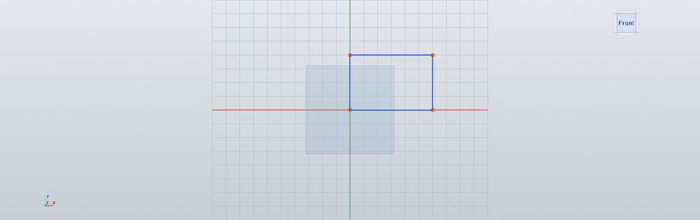

# Getting started with Grok CAD

A short path from **clone → first solid → save**.  
If you only want install commands, see the root [README](../README.md#quick-start).

---

## Contents

1. [Install](#1-install)
2. [Launch the app](#2-launch-the-app)
3. [Tour the UI](#3-tour-the-ui)
4. [Your first part (5 minutes)](#4-your-first-part-5-minutes)
5. [Constraints & dimensions](#5-constraints--dimensions)
6. [More modeling tools](#6-more-modeling-tools)
7. [Save, open, export](#7-save-open-export)
8. [Keyboard reference](#8-keyboard-reference)
9. [Troubleshooting](#9-troubleshooting)
10. [Next steps](#10-next-steps)

> Prefer a styled page? Open the rendered guide: **[getting-started.html](getting-started.html)** (works offline with images).

---

## 1. Install

### Requirements

| | |
|--|--|
| **Python** | **3.12** recommended (VTK wheels are most reliable) |
| **OS** | Linux, WSL2, or Windows |
| **GPU** | Optional — software GL works (slower) |

### Clone

```bash
git clone https://github.com/citax/Grok-CAD.git
cd Grok-CAD
```

### Create a virtualenv

**WSL / Linux — put the venv on the Linux filesystem**, not under `/mnt/c`.  
VTK loads many `.so` files; a Windows mount is slow and can break imports.

```bash
# With uv (recommended)
uv venv "$HOME/.venvs/grok-cad" --python 3.12
uv pip install --python "$HOME/.venvs/grok-cad/bin/python" -r requirements.txt
ln -sfn "$HOME/.venvs/grok-cad" .venv
```

Plain `venv` also works:

```bash
python3.12 -m venv .venv
source .venv/bin/activate   # Windows: .venv\Scripts\activate
pip install -r requirements.txt
```

### Verify tests (optional)

```bash
source .venv/bin/activate
pytest -q
```

---

## 2. Launch the app

| Platform | Command |
|----------|---------|
| Linux / WSL | `./run_cad.sh` |
| Windows (cmd) | `run_cad.cmd` |
| Windows (PowerShell) | `.\run_cad.ps1` |

`run_cad.sh` forces software GL and `xcb` so WSLg + VTK stay stable.

You should see the dark (or light) shell: **Feature Tree** left, **viewport** center, **PropertyManager** right, **Command Manager** on top.

<p align="center">
  
</p>

---

## 3. Tour the UI

| Region | What it does |
|--------|----------------|
| **Feature Tree** | Reference planes + your sketches/features history |
| **Command Manager** | Tabs: **Features** · **Sketch** · **Evaluate** |
| **Viewport** | Orbit (LMB drag), pan/zoom (VTK defaults), View Cube |
| **PropertyManager** | Params for the active selection or command (~240px) |
| **Menus** | File / Edit / Settings / View / Insert |

<p align="center">
  
  &nbsp;
  
</p>

**SolidWorks-like flow:** select something → start a command → set params in the PropertyManager → **Apply** / confirm. Failed features leave the part unchanged.

---

## 4. Your first part (5 minutes)

Goal: a simple rectangular block (and optionally a hole).

### Step A — Sketch on the Front plane

1. In the Feature Tree, click **Front Plane** (or start **Sketch** from Features / Insert).  
2. Command Manager switches to **Sketch**.  
3. Choose **Rectangle** (or **Line**).  
4. Draw a closed rectangle on the grid.

<p align="center">
  
</p>

Blue geometry usually means **under-defined** (still free to drag). That is normal until you add dimensions/constraints.

### Step B — Drive the size

1. Use **Smart Dim** / dimension tools.  
2. Click edges and type values (e.g. **20 mm** × **10 mm**).  
3. When fully constrained, geometry turns **black** (fully defined).

<p align="center">
  
</p>

Closed profiles can show a **fill** when ready for a solid feature:

<p align="center">
  
</p>

### Step C — Exit sketch and Extrude

1. Click **Exit** (or leave sketch mode).  
2. Select the sketch (or use **Extrude** from Features / press `E`).  
3. In the PropertyManager, set depth (e.g. **8 mm**).  
4. **Apply**.

You now have a solid body in the tree (e.g. **Extrude1**).

### Step D — (Optional) Boss on a face

1. Click a face of the solid.  
2. Start a new **Sketch** on that face.  
3. Draw a smaller profile → **Extrude** again.  
4. The boss **merges** (boolean union) into one continuous body — no double-counted volume.

<p align="center">
  
</p>

### Step E — (Optional) Pocket / cut

- **Pocket** or **Cut-Extrude** removes material.  
- Section view (`Ctrl+Shift+S`) helps inspect interiors.

<p align="center">
  
</p>

---

## 5. Constraints & dimensions

Constraints and driving dimensions are **promises**: they keep working after drag, save, and reopen.  
If a new constraint **conflicts**, the app refuses it and leaves the sketch unchanged.

### Common constraints

| Tool | Meaning |
|------|---------|
| Horizontal / Vertical | Line stays axis-aligned |
| Parallel / Perpendicular | Two lines |
| Equal | Equal lengths (or equal radius for arcs/circles) |
| Coincident | Points share a location |
| Fix | Lock a point in place |
| Tangent | Smooth line–arc join |
| Midpoint · Concentric · Collinear · Symmetric | Advanced layout |

### Driving dimensions

| Kind | Use on |
|------|--------|
| Linear | Line length, rect sides |
| Diameter / Radius | Circles, arcs |
| Angle | Two lines |

Partial under-constraint is fine — only over-constraint is rejected.

---

## 6. More modeling tools

From the **Features** Command Manager (or **Insert** menu):

| Tool | Shortcut | Role |
|------|----------|------|
| Sketch | `S` | Start / edit sketch on plane or face |
| Extrude | `E` | Boss pad from closed profile |
| Cut-Extrude | `C` | Remove material |
| Revolve | `R` | Revolve profile about an axis |
| Fillet | `F` | **Edge** fillet on a solid (not sketch corners) |
| Pocket | `P` | Circular pocket / hole style cut |
| Chamfer | — | Edge chamfer |
| Linear / Circular / Mirror | — | Patterns & symmetry |
| Plane | — | Offset reference plane |

**Fillet** rounds **edges on the solid** after you have a body. Select edges → set radius → Apply.

---

## 7. Save, open, export

| Action | Shortcut | Format |
|--------|----------|--------|
| New | `Ctrl+N` | Empty project |
| Open | `Ctrl+O` | `.gcad` |
| Save / Save As | `Ctrl+S` | `.gcad` project |
| Export STL | `Ctrl+E` | Mesh for print / other tools |
| Undo / Redo | `Ctrl+Z` / `Ctrl+Y` | History stack |

`.gcad` stores the feature tree and sketches so you can reopen and edit later — not just a dead mesh.

---

## 8. Keyboard reference

### File & edit

| Key | Action |
|-----|--------|
| `Ctrl+N` | New |
| `Ctrl+O` | Open |
| `Ctrl+S` | Save |
| `Ctrl+E` | Export STL |
| `Ctrl+Z` | Undo |
| `Ctrl+Y` / `Ctrl+Shift+Z` | Redo |
| `Ctrl+X` / `C` / `V` | Cut / Copy / Paste (sketch) |
| `Delete` | Delete selection |
| `Ctrl+L` | Set length |

### Features

| Key | Action |
|-----|--------|
| `S` | Sketch |
| `E` | Extrude |
| `C` | Cut-Extrude |
| `R` | Revolve |
| `F` | Fillet |
| `P` | Pocket |

### View

| Key | Action |
|-----|--------|
| `Ctrl+F` | Fit all |
| `Ctrl+Shift+S` | Section view |
| `Space` | (view / triad related shortcut) |
| LMB drag | Orbit |
| View Cube | Jump to named views |

---

## 9. Troubleshooting

### Import / VTK errors on WSL

```
Failed to load vtkRenderingVolumeOpenGL2: No module named vtkmodules...
```

**Fix:** recreate the venv under `$HOME` (not `/mnt/c`), reinstall `requirements.txt`, re-link `.venv`.

### Blank / black viewport

Often software-GL or Qt platform mismatch. Prefer:

```bash
./run_cad.sh   # sets LIBGL_ALWAYS_SOFTWARE=1 and QT_QPA_PLATFORM=xcb
```

### App hangs on close in automation

Use unattended mode so dirty docs discard without dialogs:

```bash
GROK_CAD_UNATTENDED=1 QT_QPA_PLATFORM=offscreen python -m app.main
```

### Feature failed

Read the status / PropertyManager message. The part should be **unchanged** — fix selection or params and try again.

---

## 10. Next steps

- Browse more screenshots in [`docs/media/`](media/)  
- Read product rules in [`AGENTS.md`](../AGENTS.md)  
- Contribute: [`CONTRIBUTING.md`](../CONTRIBUTING.md)  
- Report bugs / ideas: [GitHub Issues](https://github.com/citax/Grok-CAD/issues)  

Happy modeling.

---

<p align="center">
  <a href="../README.md">← Back to README</a>
  ·
  <a href="https://github.com/citax/Grok-CAD">Repository</a>
</p>
